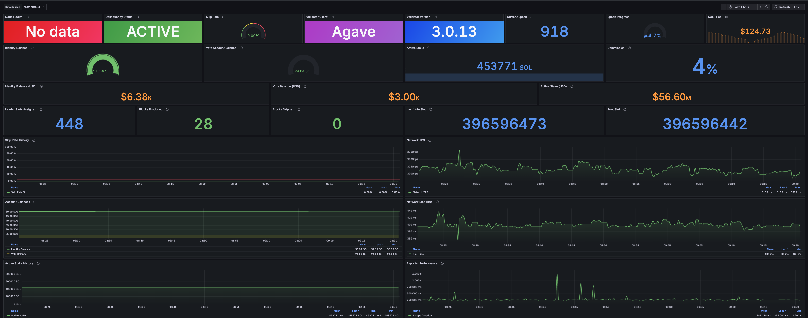

# solana-exporter

**Production-grade Prometheus exporter for Solana validator observability**

Custom Python implementation for monitoring validator performance, economic metrics, and operational health.

## The Problem

Validator operators need real-time visibility into:
- **Performance metrics**: Skip rate, block production, delinquency status
- **Economic health**: Account balances, active stake, commission rates
- **Operational status**: Node health, epoch progress, network conditions

Without proper instrumentation, validators can become delinquent or underperform without operator awareness, leading to lost rewards and reputation damage.

## The Solution

**Custom Prometheus exporter** that:
- Works with any Solana validator client (Agave, Jito, Firedancer)
- Exposes 30+ validator metrics in Prometheus format
- Calculates skip rate efficiently via `getBlockProduction` API (avoiding slow per-block polling)
- Provides async RPC calls for sub-second scrape times
- Includes production-ready Grafana dashboard with 31 panels
- Real-time SOL/USD price tracking with USD-converted balances
- Exports metrics compatible with standard alerting and visualization tools



## Why This Matters for Validator Operations

**Performance Monitoring**: Track skip rate and block production to maintain validator reputation

**Economic Visibility**: Monitor account balances and stake to prevent operational failures

**Operational Alerting**: Real-time delinquency and health status for proactive incident response

**Production Readiness**: Async implementation, error handling, and comprehensive metrics for enterprise use

## Architecture

```
┌──────────────────────────────────────────────────────────────┐
│ Solana Validator (RPC API)                                   │
│ • getHealth  • getVoteAccounts  • getBlockProduction         │
│ • getEpochInfo  • getLeaderSchedule  • getBalance            │
└─────────────────────────┬────────────────────────────────────┘
                          │
                          │ Async HTTP calls (httpx)
                          ▼
┌──────────────────────────────────────────────────────────────┐
│ Python Exporter (FastAPI)                                    │
│ • Port 8080   • /metrics + /blocks   • ~0.26s scrape time    │
│ • 30+ metrics   • Environment config   • Error handling      │
└─────────────────────────┬────────────────────────────────────┘
                          │
                          │ Scrape every 15s
                          ▼
┌──────────────────────────────────────────────────────────────┐
│ Prometheus (Time-Series Database)                            │
│ • Port 9090   • Metric storage   • Alert evaluation          │
└─────────────────────────┬────────────────────────────────────┘
                          │
                          │ Query metrics
                          ▼
┌──────────────────────────────────────────────────────────────┐
│ Grafana (Visualization)                                      │
│ • Port 3000   • 31-panel dashboard   • Color-coded alerts    │
└──────────────────────────────────────────────────────────────┘
```

## Features

### Critical Validator Metrics
- **Skip Rate**: Block production success rate (calculated via `getBlockProduction`)
- **Delinquency**: Validator voting status (0=active, 1=delinquent)
- **Balances**: Identity and vote account SOL balances
- **Stake**: Active stake delegated to validator
- **Performance**: Leader slots assigned, blocks produced, blocks skipped

### Operational Metrics
- Node health status (1=healthy, 0=down)
- Validator software version and client type detection (Agave, Jito, Firedancer)
- Epoch progress and slot tracking
- Last vote slot and root slot
- Commission rate

### Price & USD Conversions
- Real-time SOL/USD price (via CoinGecko API)
- Identity balance in USD
- Vote account balance in USD
- Active stake value in USD

### Inflation Rewards & Epoch Fees
- **Inflation Rewards**: SOL earned from staking rewards each epoch (via `getInflationReward`)
- **Transaction Fees**: Total fees earned from blocks you produced this epoch
- Both displayed in SOL and USD
- Historical comparison (current vs previous epoch rewards)

### Block Production Table
- Real-time view of your leader slots via `/blocks` endpoint
- Last 4 completed slots with full transaction details
- Next 4 upcoming slots with countdown
- Per-slot metrics: votes, non-votes, fees earned, compute units used
- Direct links to Solscan block explorer

**Block Status Legend:**

| Status | Color | Description |
|--------|-------|-------------|
| ✅ Produced | Green | Block successfully created by your validator |
| ❌ Skipped | Red | Validator missed the slot (actual skip, impacts skip rate) |
| 📦 No Data | Gray | RPC node pruned old block data (not a skip) |
| ⏳ Upcoming | Blue | Future slot not yet reached |
| ⚠️ Error | Orange | RPC error fetching block data |

### Network Context
- Network TPS (transactions per second)
- Average slot time
- Current epoch number
- Slot height tracking

### Exporter Metadata
- Scrape duration (performance monitoring)
- Last scrape timestamp
- Build info and version

**Total**: 30+ metrics in Prometheus text format

## Validator Client Compatibility

This exporter works with **any Solana validator client** (Agave, Jito, Firedancer) because it uses only standard Solana RPC API methods:

- `getHealth` - Node health status
- `getVoteAccounts` - Validator voting and stake data
- `getBlockProduction` - Skip rate calculation
- `getEpochInfo` - Epoch progress tracking
- `getLeaderSchedule` - Leader slot assignments
- `getBalance` - Account balance queries

The implementation is **client-agnostic** and connects to any Solana RPC endpoint. Tested on Jito validators, but compatible with all implementations of the Solana RPC API specification.

## Quick Start

### Prerequisites
- Python 3.8+
- Docker (for Prometheus/Grafana) or native install
- Solana RPC endpoint (local validator or public API)

### 1. Start Exporter

```bash
cd solana-exporter

# Install dependencies
pip install -r requirements.txt

# Configure
cp .env.example .env
# Edit .env with your SOLANA_RPC_URL, SOLANA_IDENTITY_KEY, SOLANA_VOTE_KEY

# Run
python3 -m uvicorn exporter:app --host 0.0.0.0 --port 8080

# Verify
curl http://localhost:8080/metrics | grep skip_rate
```

### 2. Start Prometheus

```bash
# macOS: brew install prometheus
# Linux: https://prometheus.io/download/

prometheus --config.file=prometheus/prometheus.yml --web.listen-address=":9090"

# Verify: http://localhost:9090/targets (should show "UP")
```

### 3. Import Grafana Dashboard

**Install Grafana:**
```bash
# macOS
brew install grafana && brew services start grafana

# Linux (Ubuntu/Debian)
sudo apt-get install -y software-properties-common
sudo add-apt-repository "deb https://packages.grafana.com/oss/deb stable main"
wget -q -O - https://packages.grafana.com/gpg.key | sudo apt-key add -
sudo apt-get update && sudo apt-get install grafana
sudo systemctl start grafana-server
```

**Install Infinity plugin** (required for block production table):
1. Open http://localhost:3000 → Administration → Plugins
2. Search "Infinity" → Click Install
3. Restart Grafana: `brew services restart grafana` (or `sudo systemctl restart grafana-server`)

**Add data sources:**
1. Prometheus: http://localhost:9090
2. Infinity: URL = http://localhost:8080

**Import dashboard:**
1. Open Grafana → Dashboards → Import
2. Upload `grafana/solana-validator-overview.json` from this repo
3. Select your Prometheus data source when prompted

### 4. Verify Metrics

```bash
# Run automated tests
./test_exporter.sh
# Expected: ✓ All 11 tests passed

# Check skip rate
curl -s http://localhost:8080/metrics | grep solana_validator_skip_rate_percent

# Query Prometheus
curl 'http://localhost:9090/api/v1/query?query=solana_validator_skip_rate_percent'
```

## API Endpoints

| Endpoint | Description |
|----------|-------------|
| `/metrics` | Prometheus metrics in text format |
| `/health` | Health check (returns "healthy") |
| `/blocks` | JSON data for block production table (Grafana Infinity) |

## Metrics Reference

### Critical Alerts

| Metric | Threshold | Impact |
|--------|-----------|--------|
| `solana_validator_delinquent` | = 1 | CRITICAL: Validator not voting |
| `solana_validator_skip_rate_percent` | > 5% | CRITICAL: Poor performance |
| `solana_validator_identity_balance_sol` | < 10 SOL | CRITICAL: Operations will halt |
| `solana_validator_vote_balance_sol` | < 1 SOL | CRITICAL: Voting will stop |

### Performance Metrics

| Metric | Description |
|--------|-------------|
| `solana_validator_leader_slots_assigned` | Leader slots this epoch |
| `solana_validator_blocks_produced` | Blocks successfully produced |
| `solana_validator_blocks_skipped` | Blocks missed (skip rate numerator) |
| `solana_validator_last_vote_slot` | Last voted slot number |
| `solana_validator_root_slot` | Root slot number |

### Economic Metrics

| Metric | Description |
|--------|-------------|
| `solana_validator_activated_stake_sol` | Active stake amount (SOL) |
| `solana_validator_commission_percent` | Commission rate |
| `solana_validator_identity_balance_sol` | Identity account balance |
| `solana_validator_vote_balance_sol` | Vote account balance |
| `solana_validator_identity_balance_usd` | Identity balance in USD |
| `solana_validator_vote_balance_usd` | Vote balance in USD |
| `solana_validator_activated_stake_usd` | Active stake in USD |

### Rewards & Fees Metrics

| Metric | Description |
|--------|-------------|
| `solana_validator_last_epoch_reward_sol` | Inflation reward earned last epoch (SOL) |
| `solana_validator_last_epoch_reward_usd` | Inflation reward earned last epoch (USD) |
| `solana_validator_prev_epoch_reward_sol` | Inflation reward earned 2 epochs ago (SOL) |
| `solana_validator_epoch_fees_total_sol` | Total transaction fees earned this epoch (SOL) |
| `solana_validator_epoch_fees_total_usd` | Total transaction fees earned this epoch (USD) |
| `solana_validator_avg_fee_per_block_sol` | Average fee per block produced (SOL) |

### Node & Network Metrics

| Metric | Description |
|--------|-------------|
| `solana_node_health` | Health status (1=healthy) |
| `solana_node_version_info` | Software version |
| `solana_node_client_info` | Client type (Agave, Jito, Firedancer) |
| `solana_sol_price_usd` | Current SOL/USD price |
| `solana_epoch_number` | Current epoch |
| `solana_epoch_progress_percent` | Epoch completion (0-100%) |
| `solana_network_tps` | Network transactions per second |
| `solana_network_slot_time_ms` | Average slot time (milliseconds) |
| `solana_slot_height` | Current slot height |
| `solana_block_height` | Current block height |

## Repository Structure

```
solana-exporter/
├── exporter.py                        # Production Python exporter
├── requirements.txt                   # Python dependencies
├── .env.example                       # Configuration template
├── test_exporter.sh                   # Automated test suite (11 tests)
├── prometheus/
│   └── prometheus.yml                 # Prometheus scrape config
├── grafana/
│   └── solana-validator-overview.json # Production dashboard (31 panels)
└── docs/                              # Detailed guides (gitignored)
    ├── QUICKSTART.md
    ├── GRAFANA_SETUP.md
    ├── IMPORT_INSTRUCTIONS.md
    └── _archive/                      # Old experimental versions
```

## Alert Rules

Recommended Prometheus alert rules:

```yaml
groups:
  - name: solana_validator
    rules:
      - alert: ValidatorDelinquent
        expr: solana_validator_delinquent == 1
        for: 2m
        labels:
          severity: critical
        annotations:
          summary: "Validator is delinquent"

      - alert: HighSkipRate
        expr: solana_validator_skip_rate_percent > 5
        for: 10m
        labels:
          severity: critical
        annotations:
          summary: "Skip rate above 5% for 10 minutes"

      - alert: LowIdentityBalance
        expr: solana_validator_identity_balance_sol < 10
        for: 5m
        labels:
          severity: critical
        annotations:
          summary: "Identity balance below 10 SOL"

      - alert: LowVoteBalance
        expr: solana_validator_vote_balance_sol < 1
        for: 5m
        labels:
          severity: critical
        annotations:
          summary: "Vote balance below 1 SOL"
```

## Production Deployment

### Docker Compose (Recommended)

```yaml
version: '3.8'
services:
  exporter:
    build: .
    ports:
      - "8080:8080"
    environment:
      - SOLANA_RPC_URL=${SOLANA_RPC_URL}
      - SOLANA_IDENTITY_KEY=${SOLANA_IDENTITY_KEY}
      - SOLANA_VOTE_KEY=${SOLANA_VOTE_KEY}
    restart: always

  prometheus:
    image: prom/prometheus:latest
    ports:
      - "9090:9090"
    volumes:
      - ./prometheus/prometheus.yml:/etc/prometheus/prometheus.yml
    restart: always

  grafana:
    image: grafana/grafana:latest
    ports:
      - "3000:3000"
    volumes:
      - grafana-storage:/var/lib/grafana
    restart: always

volumes:
  grafana-storage:
```

### Security Considerations
- **No private keys**: Only public keys (identity/vote) required
- **Read-only operations**: Exporter never signs transactions
- **Safe co-location**: Can run on validator node without security risk
- **RPC rate limiting**: Respects endpoint limits (15s default scrape interval)

## Testing

Automated test suite validates all critical functionality:

```bash
./test_exporter.sh
```

**Test Coverage:**
- ✅ Exporter responds to /health
- ✅ Exporter exposes /metrics endpoint
- ✅ Core metrics (epoch, slot height, TPS)
- ✅ Validator metrics (identity balance, stake, delinquency)
- ✅ SOL price and USD-converted balances
- ✅ Validator client type detection
- ✅ Skip rate calculation
- ✅ Delinquency status check
- ✅ Account balance thresholds
- ✅ Scrape performance
- ✅ Dashboard JSON is valid

**Tested on Production Validator (Jito client):**
- 0.0% skip rate (perfect performance)
- 451,393 SOL active stake
- Non-delinquent status
- All metrics collecting correctly
- Compatible with Agave and Firedancer via standard RPC API

## Limitations

- **Platform**: Tested on macOS and Linux (should work on Windows with WSL)
- **RPC dependency**: Requires working Solana RPC endpoint
- **Scrape frequency**: 15s default (may miss sub-second events)
- **Single validator**: Does not aggregate multi-validator fleet metrics (future enhancement)

## Roadmap

- [ ] Docker Compose for single-command deployment
- [ ] Multi-validator fleet monitoring
- [ ] SLO dashboard (uptime, performance targets)
- [ ] Alert routing integrations (PagerDuty, Slack)
- [x] Skip rate calculation
- [x] Delinquency monitoring
- [x] Grafana dashboard
- [x] Automated test suite
- [x] Inflation rewards tracking (via `getInflationReward`)
- [x] Transaction fee tracking (priority fees included)
- [x] Block production table with leader slot details

## References

**Solana Documentation:**
- [Solana RPC API](https://solana.com/docs/rpc)
- [Solana Validator Guide](https://docs.solanalabs.com/operations/guides)

**Monitoring Stack:**
- [Prometheus Best Practices](https://prometheus.io/docs/practices/naming/)
- [Grafana Dashboard Design](https://grafana.com/docs/grafana/latest/dashboards/build-dashboards/best-practices/)

**Community:**
- [Validators.app](https://www.validators.app/) - Validator rankings
- [Solana Beach](https://solanabeach.io/) - Network explorer

## Contributing

Issues and feedback are welcome. Not currently accepting pull requests.

## License

MIT License - See project for details.
